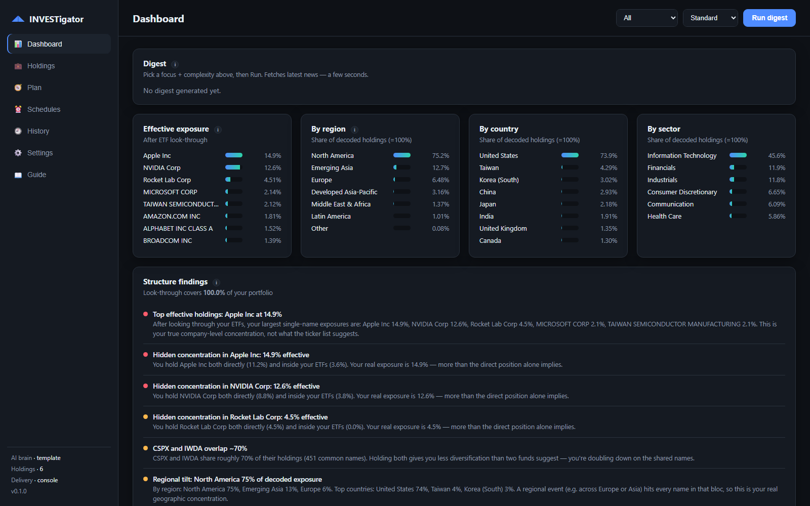
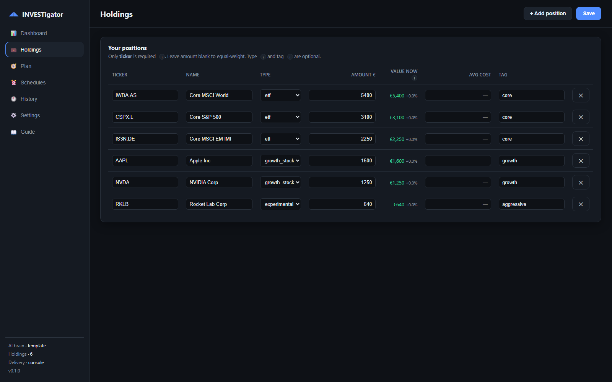
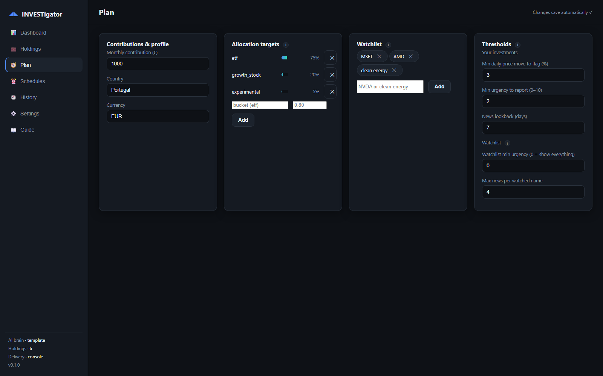
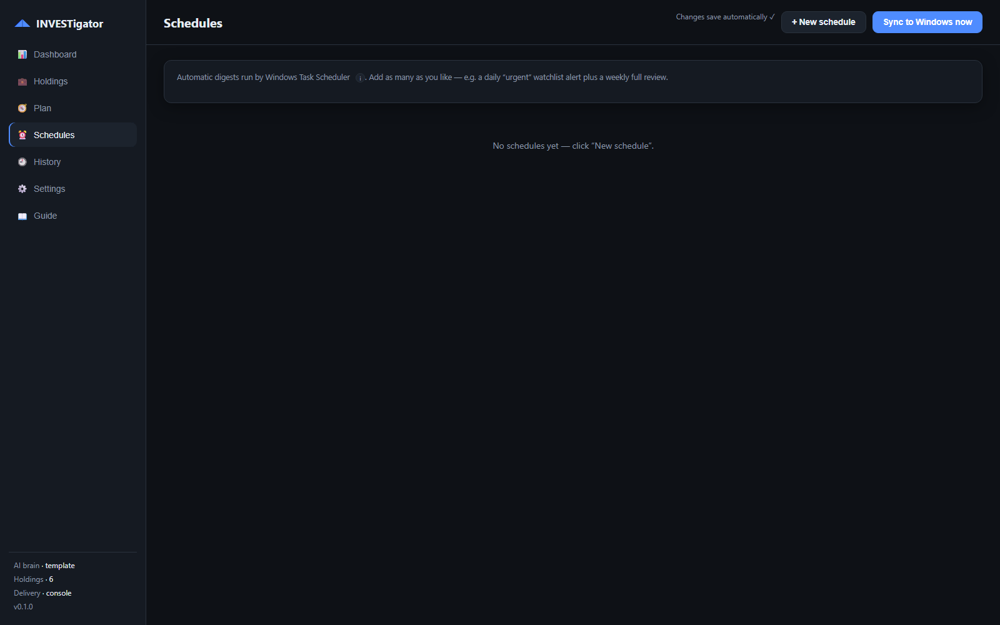
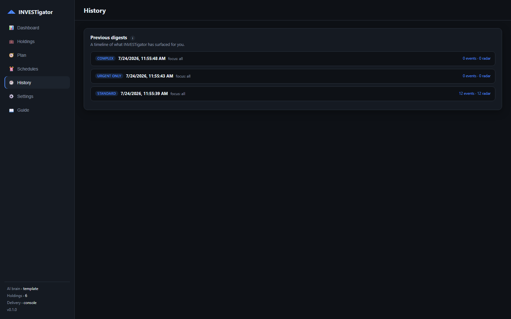

<div align="center">


# INVESTigator

**A personal investment intelligence desktop app — a context amplifier for your own thinking, not a trading assistant.**

It watches what you actually own, decodes what's really inside your ETFs, and sends you a calm,
noise-filtered briefing that explains *why each thing matters to you*. It never says buy or sell.

[](LICENSE)


[](https://buymeacoffee.com/joao.serrao)



</div>

---

## Why

Most portfolio tools either scream at you or drown you in charts. INVESTigator answers a narrower,
more useful question: **out of everything that happened, what actually touches my money — and why?**

Every number is computed in code. The AI only writes the prose, and it's forbidden from inventing
figures or giving advice.

## What it does

- **ETF look-through** — decomposes your ETFs into their real holdings (free iShares daily feed), so
  you see your *true* company exposure: e.g. "Apple is 17.5% once your World ETF is decoded, not the
  16% the ticker list suggests."
- **Hidden concentration** — names you hold both directly *and* inside funds.
- **ETF overlap** — two funds quietly holding the same companies.
- **Region / country / sector tilt** — grouped into blocs (Europe, Emerging Asia…), because a regional
  event hits every name in it.
- **Plan drift** — your real allocation vs the targets you set.
- **Noise-filtered news** — only material items (earnings, lawsuits, M&A…), scored by how much they
  touch *your* capital, deduplicated, and capped so one busy stock can't flood the digest.
- **Watchlist / discovery** — a separate "On your radar" section for things you don't own yet.
- **Automatic digests** — multiple schedules (daily/weekly/monthly), each with its own complexity and
  focus, run by Windows Task Scheduler. Missed runs fire on next power-on.
- **Delivery** — console, Discord webhook, or email. Optionally skip sending when nothing was found.
- **History** — every digest is saved and re-openable.

## Screenshots

<table>
<tr>
<td width="50%"><br/>
<b>Holdings</b> — just a ticker is required. Values track price movement automatically.</td>
<td width="50%"><br/>
<b>Plan</b> — allocation targets, watchlist, and how aggressively to filter noise.</td>
</tr>
<tr>
<td width="50%"><br/>
<b>Schedules</b> — automatic digests, each with its own depth and focus.</td>
<td width="50%"><br/>
<b>History</b> — every digest is saved and re-openable.</td>
</tr>
</table>

<sub>Screenshots use demo data.</sub>

## Design principles

1. **Numbers in code, prose in the LLM.** The model never does arithmetic on your portfolio.
2. **No raw alerts.** Every item explains why it matters *to you*.
3. **Never optimize for action pressure.** No buy/sell/hold, ever.
4. **Honest data.** Freshness and coverage are always labelled; what can't be decoded is shown as such.
5. **Local and private.** Your holdings never leave your machine (unless you opt into a cloud LLM).

## Install

Grab the latest **`INVESTigator_x64-setup.exe`** from [Releases](../../releases) and run it.
Windows SmartScreen may warn because the build isn't code-signed — *More info → Run anyway*.

Your data lives in `%APPDATA%\Investraton` (holdings, settings, database). Nothing is uploaded.

## First run

1. **Holdings** — add what you own. Only the ticker is required (Yahoo-style: `IWDA.AS`, `AAPL`).
   Amounts are optional; with them you get exposure-weighted relevance.
2. **Plan** — set allocation targets, a watchlist, and how aggressively to filter.
3. **Dashboard** — hit *Run digest*.
4. *(Optional)* **Settings** — pick an AI brain (works fine without one) and a delivery channel.
5. *(Optional)* **Schedules** — automate it.

The in-app **Guide** explains every field, plus how to set up Ollama, email, and Discord.

## AI is optional

| Mode | What you get |
| --- | --- |
| **Template** (default) | No AI at all. Deterministic text. Always works, fully offline. |
| **Ollama** | Free, local, private prose. Install Ollama, pull a model, select it. |
| **Claude** | Best writing quality. Bring your own API key. |

Whatever you choose, the figures come from the engine — never the model.

## Build from source

Requires Python 3.11+, Rust, Node, and MSVC Build Tools.

```powershell
python -m venv .venv
.\.venv\Scripts\python.exe -m pip install -e ".[app]"

# run the app locally (http://127.0.0.1:8765)
.\.venv\Scripts\python.exe -m investraton app

# build the distributable installer
powershell -ExecutionPolicy Bypass -File packaging\build.ps1
```

Architecture and packaging details: [docs/PACKAGING.md](docs/PACKAGING.md).

<details>
<summary><b>CLI</b></summary>

```powershell
python -m investraton doctor      # config / health check
python -m investraton holdings    # positions + weights
python -m investraton structure   # look-through, concentration, plan drift
python -m investraton digest      # full run -> deliver
python -m investraton schedules   # list / sync scheduled digests
```
</details>

## Data sources

All free and public: **yfinance** (prices), **Google News + Yahoo RSS** (news, plus any site or feed
you add), **iShares** daily holdings files (ETF look-through). No paid APIs, no broker connection —
XTB discontinued its API and Degiro never had one, so holdings are entered by you and enriched here.

## Disclaimer

INVESTigator is an information tool, **not financial advice**. It deliberately never recommends buying,
selling, or holding anything. Data comes from free public sources and may be delayed, incomplete, or
wrong. Always verify with your broker before making decisions. You are responsible for your own money.

## Support

INVESTigator is free and open source. If it's useful to you, you can
[**buy me a coffee**](https://buymeacoffee.com/joao.serrao) ☕ — it's genuinely appreciated and
helps keep it maintained.

## License

[MIT](LICENSE) © João Serrão
