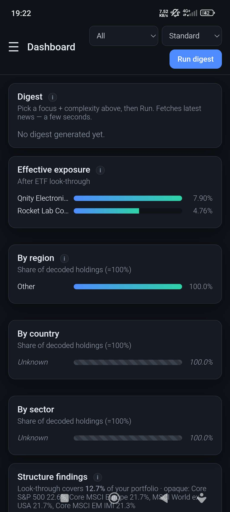
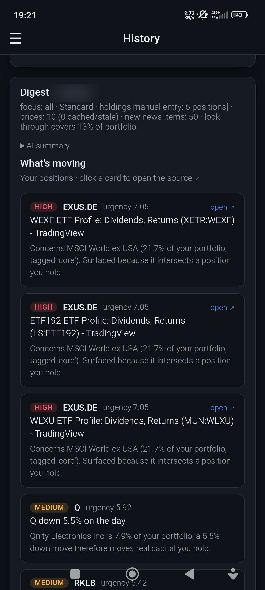
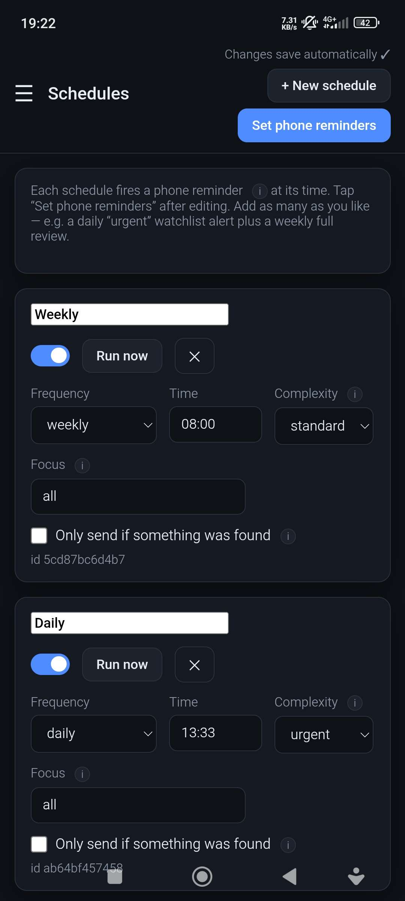
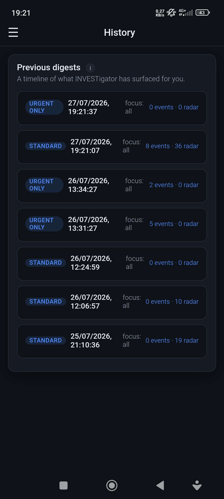

<div align="center">


# INVESTigator

**A personal investment intelligence app for desktop & Android — a context amplifier for your own thinking, not a trading assistant.**

It watches what you actually own, decodes what's really inside your ETFs, and sends you a calm,
noise-filtered briefing that explains *why each thing matters to you*. It never says buy or sell.

[](LICENSE)


[](https://buymeacoffee.com/joao.serrao)


</div>

---

## Why

Most portfolio tools either scream at you or drown you in charts. INVESTigator answers a narrower,
more useful question: **out of everything that happened, what actually touches my money — and why?**

Every number is computed in code. The AI only writes the prose, and it's forbidden from inventing
figures or giving advice.

## What it does

- **ETF look-through** — decomposes your ETFs into their real holdings (free iShares daily feed), so
  you see your *true* company exposure: e.g. "Apple is 17.5% once your World ETF is decoded, not the
  16% the ticker list suggests."
- **Hidden concentration** — names you hold both directly *and* inside funds.
- **ETF overlap** — two funds quietly holding the same companies.
- **Region / country / sector tilt** — grouped into blocs (Europe, Emerging Asia…), because a regional
  event hits every name in it.
- **Plan drift** — your real allocation vs the targets you set.
- **Noise-filtered news** — only material items (earnings, lawsuits, M&A…), scored by how much they
  touch *your* capital, deduplicated, and capped so one busy stock can't flood the digest.
- **Watchlist / discovery** — a separate "On your radar" section for things you don't own yet.
- **Automatic digests** — multiple schedules (daily/weekly/monthly), each with its own complexity and
  focus. On desktop they run via Windows Task Scheduler (missed runs fire on next power-on); on Android
  a reminder fires at the set time and the digest runs when you open the app.
- **Delivery** — console, Discord webhook, or email. Optionally skip sending when nothing was found.
- **History** — every digest is saved and re-openable.

## Screenshots

<table>
<tr>
<td width="50%"><br/>
<b>Holdings</b> — just a ticker is required. Values track price movement automatically.</td>
<td width="50%"><br/>
<b>Plan</b> — allocation targets, watchlist, and how aggressively to filter noise.</td>
</tr>
<tr>
<td width="50%"><br/>
<b>Schedules</b> — automatic digests, each with its own depth and focus.</td>
<td width="50%"><br/>
<b>History</b> — every digest is saved and re-openable.</td>
</tr>
</table>

<sub>Desktop screenshots use demo data.</sub>

## On your phone (Android)

The whole app runs on Android too — the **exact same** TypeScript engine in a Tauri WebView, fully
offline. Look-through, noise-filtered digests, history and delivery all work identically to desktop.
**The one real difference is how automation fires** (see below).

<table>
<tr>
<td width="50%"><br/>
<b>Dashboard</b> — your true exposure after ETF look-through, region/country/sector, on your phone.</td>
<td width="50%"><br/>
<b>Digest</b> — "what's moving", each item scored by how much it touches <em>your</em> capital.</td>
</tr>
<tr>
<td width="50%"><br/>
<b>Schedules</b> — set a reminder per schedule; tap <em>Set phone reminders</em> to arm them.</td>
<td width="50%"><br/>
<b>History</b> — every digest saved and re-openable, same as desktop.</td>
</tr>
</table>

<sub>The portfolio total in the digest screenshot is blurred; everything else is a real run.</sub>

### Automation: fully automatic on desktop, one tap on Android

| | Desktop (Windows) | Android |
| --- | --- | --- |
| **How a scheduled digest runs** | **Fully automatic** — Windows Task Scheduler fires it headless in the background, even with the app closed. | A **reminder notification** fires at the scheduled time and **you tap it to run the digest.** |
| **Why** | A desktop process can run headless. | Android forbids silent background execution without a persistent foreground service, so the notification *is* the trigger — one tap runs, delivers, and saves it. |
| **Missed runs** | Fire on next power-on. | Catch up automatically when you next open the app. |

So on your phone a digest is always **one tap away**, never silent — by design. Everything else
(the computation, delivery to Discord/email, and history) is identical to desktop.

## Design principles

1. **Numbers in code, prose in the LLM.** The model never does arithmetic on your portfolio.
2. **No raw alerts.** Every item explains why it matters *to you*.
3. **Never optimize for action pressure.** No buy/sell/hold, ever.
4. **Honest data.** Freshness and coverage are always labelled; what can't be decoded is shown as such.
5. **Local and private.** Your holdings never leave your machine (unless you opt into a cloud LLM).

## Install

- **Windows** — grab the latest **`INVESTigator_x64-setup.exe`** from [Releases](../../releases) and run
  it. SmartScreen may warn because the build isn't code-signed — *More info → Run anyway*. Your data
  lives in `%APPDATA%\Investraton` (holdings, settings, database); nothing is uploaded.
- **Android** — install the APK from [Releases](../../releases) (allow "install unknown apps"). It
  starts empty; use **Settings → Backup & transfer** to import a backup exported from desktop.

Both run the exact same TypeScript engine.

## First run

1. **Holdings** — add what you own. Only the ticker is required (Yahoo-style: `IWDA.AS`, `AAPL`).
   Amounts are optional; with them you get exposure-weighted relevance.
2. **Plan** — set allocation targets, a watchlist, and how aggressively to filter.
3. **Dashboard** — hit *Run digest*.
4. *(Optional)* **Settings** — pick an AI brain (works fine without one) and a delivery channel.
5. *(Optional)* **Schedules** — automate it.

The in-app **Guide** explains every field, plus how to set up Ollama, email, and Discord.

## AI is optional

| Mode | What you get |
| --- | --- |
| **Template** (default) | No AI at all. Deterministic text. Always works, fully offline. |
| **Ollama** | Free, local, private prose. Install Ollama, pull a model, select it. |
| **Claude** | Best writing quality. Bring your own API key. |

Whatever you choose, the figures come from the engine — never the model. (Ollama is desktop-only;
on Android it's Template or Claude.)

## How it's built

The whole intelligence engine is **pure TypeScript** ([`engine/`](engine)) — deterministic,
dependency-light logic with no runtime backend. It runs directly inside a **Tauri 2** WebView
([`desktop-ts/`](desktop-ts)) on both Windows and Android; the same engine, the same vanilla-JS UI
([`web/`](web)), only the platform adapter differs. There is no server and no Python.

Requires Rust, Node, and MSVC Build Tools (plus the Android SDK/NDK for the mobile target).

```bash
cd desktop-ts
npm install
npm run tauri dev                         # run the desktop app
npm run tauri build                       # Windows installers (NSIS + MSI)
npm run tauri -- android build --apk      # Android APK (see desktop-ts/README.md)
```

Build details: [desktop-ts/README.md](desktop-ts/README.md). How the engine was ported from an
earlier Python implementation (and verified for exact output parity): [docs/PORTING.md](docs/PORTING.md).
Cutting a release (version bump, installers, APK, tags, GitHub Pages): [docs/RELEASING.md](docs/RELEASING.md).

## Data sources

All free and public: **Yahoo Finance** (prices), **Google News + Yahoo RSS** (news, plus any site or
feed you add), **iShares** daily holdings files (ETF look-through). No paid APIs, no broker connection —
XTB discontinued its API and Degiro never had one, so holdings are entered by you and enriched here.

## Disclaimer

INVESTigator is an information tool, **not financial advice**. It deliberately never recommends buying,
selling, or holding anything. Data comes from free public sources and may be delayed, incomplete, or
wrong. Always verify with your broker before making decisions. You are responsible for your own money.

## Support

INVESTigator is free and open source. If it's useful to you, you can
[**buy me a coffee**](https://buymeacoffee.com/joao.serrao) ☕ — it's genuinely appreciated and
helps keep it maintained.

## License

[MIT](LICENSE) © João Serrão
